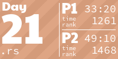
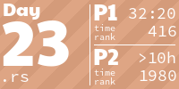

<!-- AOC TILES BEGIN -->
<h1 align="center">
  Advent of Code - 500/500 ⭐
</h1>
<h1 align="center">
  2024 - 50 ⭐ - Rust
</h1>

<h1 align="center">
  2023 - 50 ⭐ - Rust
</h1>

<h1 align="center">
  2022 - 50 ⭐ - Rust
</h1>

<h1 align="center">
  2021 - 50 ⭐ - Rust
</h1>

<h1 align="center">
  2020 - 50 ⭐ - Rust
</h1>

<h1 align="center">
  2019 - 50 ⭐ - Rust
</h1>

<h1 align="center">
  2018 - 50 ⭐ - Rust
</h1>

<h1 align="center">
  2017 - 50 ⭐ - Rust
</h1>

<h1 align="center">
  2016 - 50 ⭐ - Rust
</h1>

<h1 align="center">
  2015 - 50 ⭐ - Rust
</h1>

<!-- AOC TILES END -->

## Timings

timings from `echo "" > timings.out;for i in {1..25}
  hyperfine -N --warmup 10 "./target/release/2025 $i" >> timings.out`
